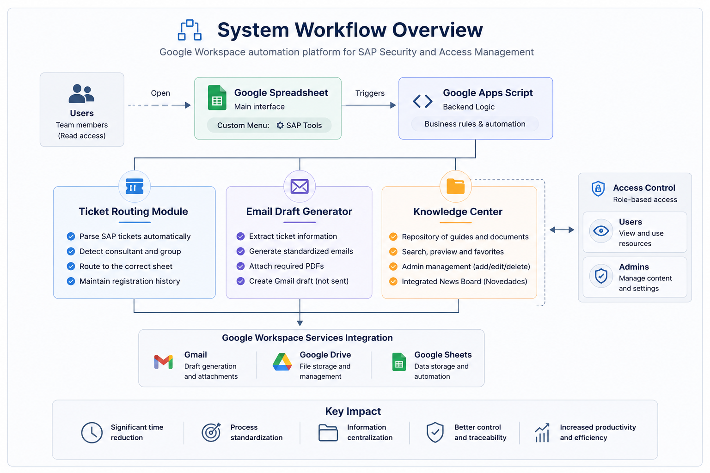
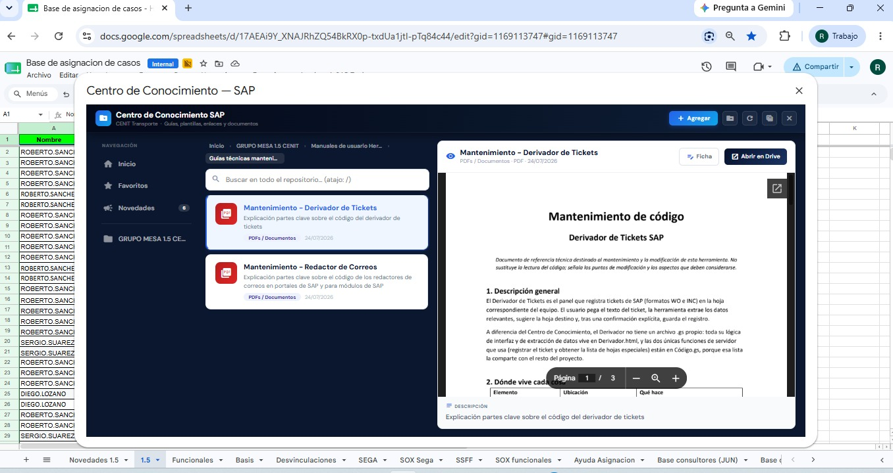
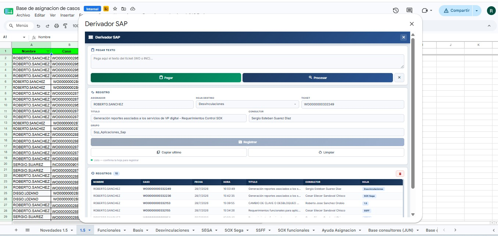

# Google Workspace Workflow Automation Platform

Automation platform developed with Google Apps Script to optimize internal SAP support workflows through Google Workspace.


---

## Project Overview

This project was developed during my professional internship to automate repetitive administrative tasks performed by the SAP Security and Access Management team.

Instead of manually processing tickets, writing emails, searching documentation and registering information across multiple spreadsheets, the platform centralizes these workflows into a single Google Workspace application.

The solution significantly reduced the time required to complete daily operations while improving information organization, consistency and accessibility across the team.

---

## Main Features

- Knowledge Center for documentation management
- SAP Ticket Routing System
- Automatic Email Draft Generator
- Dynamic News Panel
- Google Drive integration
- Google Sheets integration
- Gmail draft generation
- Search engine and favorites
- Audit log and activity history
- Administrator permission management

---

## Modules

### System workflow



### Knowledge Center



A centralized repository that allows users to:

- Browse documentation
- Search resources instantly
- Preview PDFs, images and videos
- Organize files into folders
- Mark favorites
- Upload new resources (administrators)
- Manage categories and documentation

Only authorized administrators can create or delete resources, folders and announcements, while every user has read-only access. The system also records every modification through an activity log for auditing purposes. :contentReference

---

### Ticket Routing



The routing module automatically extracts ticket information from SAP support requests and registers it into the appropriate spreadsheet.

Main capabilities:

- Automatic ticket parsing
- Destination sheet recommendation
- Consultant detection
- Ticket classification
- Registration history
- Validation before saving

This automation eliminates repetitive manual data entry and reduces registration errors. :contentReference

---

### Email Draft Generator


Automatically generates standardized Gmail drafts directly from SAP tickets.

Features include:

- Ticket parsing
- Automatic field extraction
- Live email preview
- PDF attachment support
- Gmail draft generation
- Standardized corporate templates

The generated email is created as a draft, allowing the user to review it before sending. :contentReference

---

### Dynamic News Panel

The platform includes a dynamic announcement board where administrators can publish temporary notices for different SAP modules.

Features:

- Publication expiration dates
- Automatic removal of expired announcements
- Administrator-only management
- Centralized communication

This ensures that outdated information is automatically removed without manual intervention.

---

## Technologies Used

- Google Apps Script
- JavaScript
- HTML5
- CSS3
- Google Sheets API
- Gmail Services
- Google Drive Services
- HTMLService

---

## Repository Structure

```text
Code/
├── appsscripts.json
├── codigo.gs
├── centro_conocimiento.gs
├── novedades.gs
├── derivador.html
├── redactor_portales.html
├── redactor_sap.html
└── Repositorio.html

Documentation/
├── User Guides
└── Maintenance Manuals

Images/

README.md
```

---

## Impact

The platform successfully achieved its primary objective of reducing repetitive manual work within the SAP support team.

The implemented automation contributed to:

- Significant reduction in ticket processing time
- Faster email generation
- Improved documentation organization
- Centralized knowledge management
- Standardized operational workflows
- Easier access to technical resources
- Better traceability through activity logs

---

## Skills Demonstrated

- Google Apps Script
- JavaScript
- HTML/CSS
- Google Workspace Automation
- UI Design
- Process Automation
- Information Management
- Workflow Optimization
- Software Architecture
- Technical Documentation
- SAP Process Automation

---

## Documentation

The repository includes:

- User guides
- Maintenance manuals
- Technical documentation
- System configuration documentation

---

## Author

Roberto Sánchez
